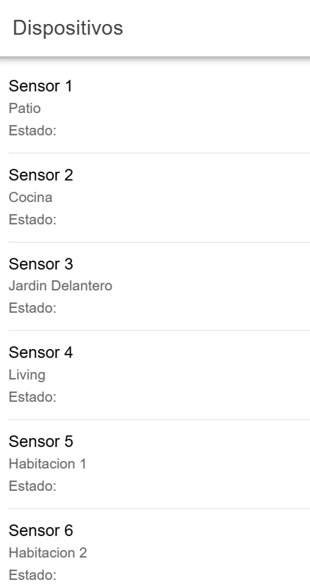
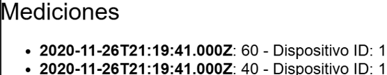

Trabajo Práctico Final - DAM

Este proyecto es una aplicación web fullstack que se ejecuta sobre el ecosistema Docker.

Comenzando:

Para correr este proyecto es necesario que instale Docker y Docker Compose.

Descargar el código:

Para descargar el código, lo más conveniente es realizar un fork de este proyecto a su cuenta personal.

Ejecutar la aplicación:

Para ejecutar la aplicación se debe correr el comando docker-compose up desde la raíz del proyecto. Este comando va a descargar las imágenes Docker de node_backend, ionic_frontend, mysql_db y phpmyadmin y luego las pondrá en funcionamiento.

Para acceder al cliente web ingrese a la URL http://localhost:8100/ para acceder al admin de la DB acceda a http://localhost:8080/ (Usuario y Contraseña: root) y para comprobar las api http://localhost:3000/api/

Detalles de implementación:

Al escribir http://localhost:8100/ en el navegador web se cargará el listado de todos los dispositivos de la tabla Dispositivos de la base de datos DAM.

Se puede cargar un listado de mediciones.

Endpoints disponibles:

1. Obtener una lista de todos los dispositivos:
    Método: GET
    URL: /api/devices
    Respuesta: Devuelve una lista con todos los dispositivos.

2. Obtener detalles de un dispositivo específico:
    Método: GET
    URL: /api/devices/:id
    Respuesta: Devuelve detalles de un dispositivo específico.

3. Obtener mediciones de un dispositivo específico:
    Método: GET
    URL: /api/:id/mediciones
    Respuesta: Devuelve lista de mediciones de un dispositivo específico.

4. Accionar válvula
    Método: PUT
    URL: /api/devices/:id/encender
    Respuesta: Acciona válvula asociada a dispositivo.

5. Apagar válvula
    Método: PUT
    URL: /api/devices/:id/apagar
    Respuesta: Apaga válvula asociada a dispositivo.
